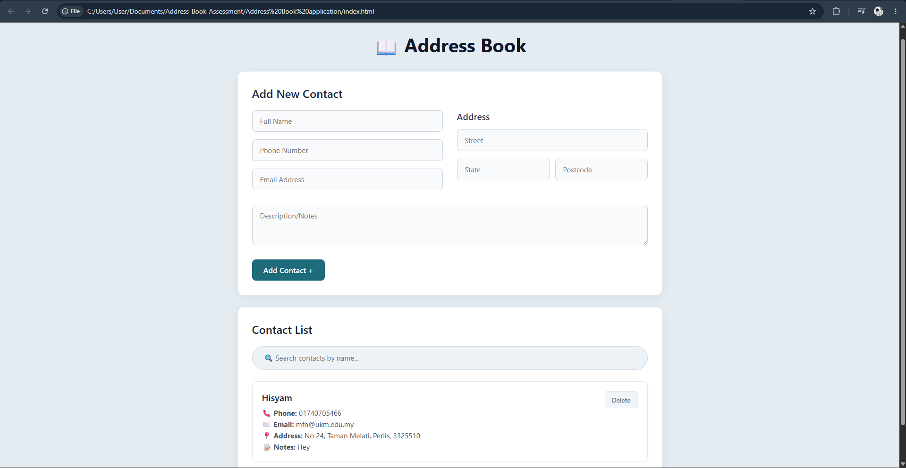
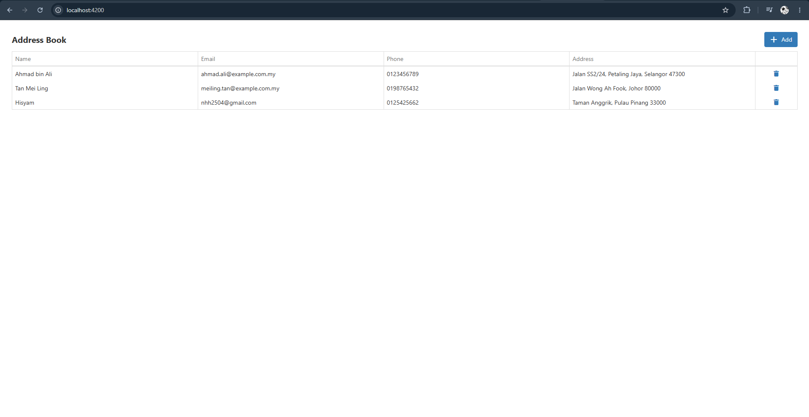

# Address Book Developer Assessment

This repository contains two technical assessments built as part of the frontend developer evaluation. Both applications implement a complete Address Book with CRUD (Create, Read, Update, Delete) functionality, but they showcase proficiency using two different approaches: Vanilla JavaScript and the Angular Framework.

---

## 1. Vanilla JavaScript Address Book
**Folder Location:** [`./Address Book application`](./Address%20Book%20application)

This project demonstrates core web development skills using pure HTML, CSS, and vanilla JavaScript without relying on heavy external frameworks. 

### Features & Explanation
* **DOM Manipulation:** Dynamically renders contact rows and handles state updates using native browser APIs.
* **CRUD Operations:** Users can easily add new contacts, view existing ones, edit details, and delete entries directly from the table.
* **Form Validation:** Ensures all required fields are filled and valid before saving.
* **Local Data Management:** Data is processed and managed effectively within the client-side session.

### Demonstration (JavaScript)



### How to Run
1. Navigate to the `Address Book application` folder.
2. Open the `index.html` file directly in your web browser (Google Chrome, Firefox, etc.) to view the app.

---

## 2. Angular + DevExtreme Address Book
**Folder Location:** [`./angular-address-book`](./angular-address-book)

This project demonstrates enterprise-level web development skills by utilizing the **Angular 17+** framework alongside **DevExtreme** UI components for a polished, robust data grid experience.

### Features & Explanation
* **Angular Architecture:** Uses standard Angular architecture, including Standalone Components and a centralized Data Service (`AddressBookService`) using Angular Signals for state management.
* **DevExtreme DataGrid (`dx-data-grid`):** Displays contact data using a high-performance grid, complete with customized cell templates and a specialized toolbar.
* **Dynamic Modals (`dx-popup`):** Clicking "Add" or selecting a row dynamically loads the `ModalComponent` into a popup window. The modal elegantly shifts between Create, View, and Edit modes.
* **Strict Validation (Reactive Forms):** Fully leverages Angular's Reactive Forms to enforce rules (e.g., proper email format, numbers-only postcodes, prohibiting letters in phone numbers).
* **Malaysian Context:** The mock data and state selection dropdowns have been specifically localized to reflect Malaysian addresses and states.

### Demonstration (Angular)



### How to Run
1. Open a terminal and navigate to the `angular-address-book` folder:
   ```bash
   cd angular-address-book
   ```
2. Install the necessary dependencies (Node.js required):
   ```bash
   npm install
   ```
3. Start the Angular development server:
   ```bash
   npm start
   ```
4. Open your web browser and navigate to `http://localhost:4200/`.
